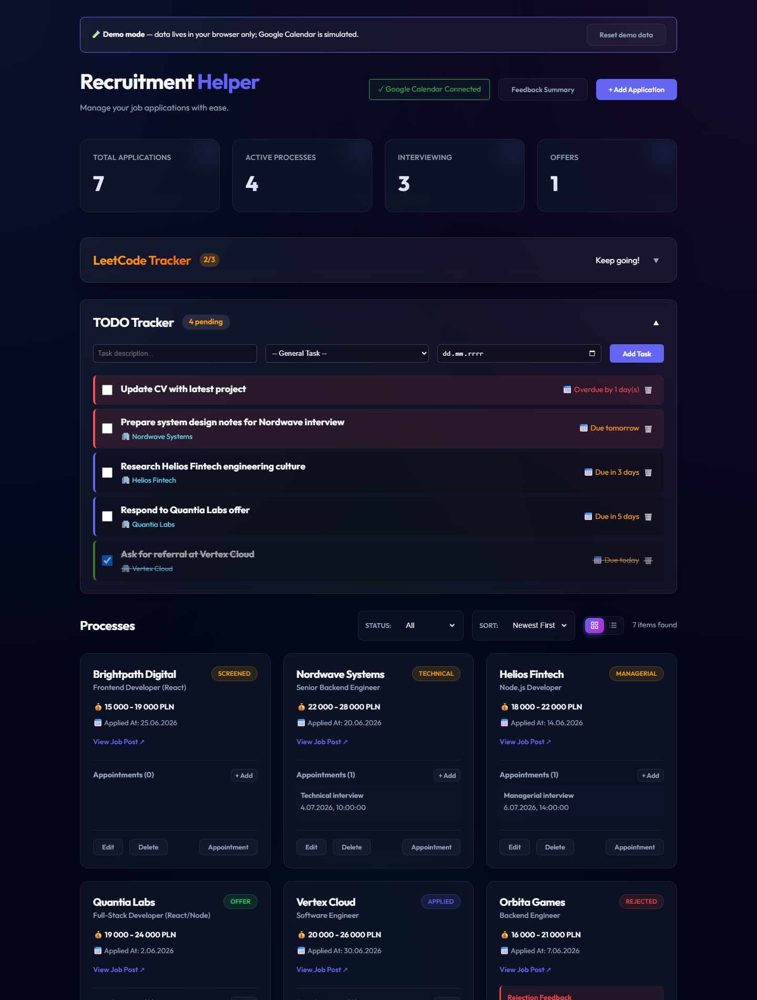

# Recruitment Helper

[](https://github.com/mga44/recruitment-helper/actions/workflows/ci.yml)

A job-hunt command center: track application processes, schedule interview appointments straight into Google Calendar, log daily LeetCode practice, and keep todos tied to specific applications — all in one dashboard.

**[▶ Live demo](https://mga44.github.io/recruitment-helper/)** — runs entirely in your browser with sample data (no backend; changes persist in localStorage).



## Features

- **Application pipeline** — track each process through `Applied → Screened → Technical → Managerial → Offer` (or `Rejected` / `Ghosted`), with salary ranges, job links, contacts, and timestamped notes. Filter by status, sort by date, switch between grid and list views.
- **Google Calendar integration** — add an interview appointment to a process and the event lands on your primary calendar via OAuth; the meet link is stored back on the process.
- **Rejection feedback summary** — collects feedback from rejected processes into a ready-to-paste LLM prompt that generates a prioritized improvement plan.
- **LeetCode tracker** — log solved problems against a daily goal with a progress ring.
- **TODO tracker** — due dates, overdue highlighting, and optional links to a specific application.

## Architecture

```
React 19 + Vite  ──►  nginx  ──/api──►  Express 5  ──►  MongoDB
   (frontend)                           (backend)   └──►  Google Calendar API (OAuth2)
```

- `frontend/` — React SPA. `src/api/` is the single API seam: at build time it selects either the real fetch client or a localStorage-backed demo implementation (`VITE_DEMO_MODE=true`), which is what the live demo runs.
- `backend/` — Express routers per domain (`processes`, `problems`, `tasks`, `auth`) with Mongoose models. `Process` is the central document; appointments and notes are embedded, tasks reference it.
- `docker-compose.yml` — three containers: MongoDB, backend (`:5000`), frontend (nginx serving the built SPA on `:8080`, proxying `/api`).

## Quick start (Docker)

```bash
docker compose up --build
# app: http://localhost:8080

# optional: load sample data (Mongo is exposed on localhost:27017)
cd backend && npm install && npm run seed
```

## Local development

```bash
# 1. MongoDB
docker compose up mongodb        # or any local MongoDB on :27017

# 2. Backend API on :5000
cd backend
npm install
cp .env.template .env            # defaults work without Google credentials
npm start

# 3. Frontend on :5173 (proxies /api to :5000)
cd frontend
npm install
npm run dev
```

### Google Calendar setup (optional)

Everything except creating appointments works without it. To enable:

1. In [Google Cloud Console](https://console.cloud.google.com/apis/credentials), create an OAuth client (type *Web application*) with the redirect URI `http://localhost:5000/api/auth/google/callback` and enable the Calendar API.
2. Put the client ID/secret into `backend/.env` (see `.env.template`).
3. Click **Connect Google Calendar** in the app header and grant access. Tokens are stored locally in `backend/tokens.json`.

## Tests

```bash
cd backend && npm test
```

Route-level tests (Jest + Supertest) run against an in-memory MongoDB — no database or configuration needed. CI runs them alongside frontend lint and build on every push.

## Demo mode

`VITE_DEMO_MODE=true npm run build` produces a fully static build where the API layer is swapped for a localStorage implementation seeded with sample data — same UI, no server. The GitHub Pages deployment is exactly this build.

## License

[MIT](LICENSE)
